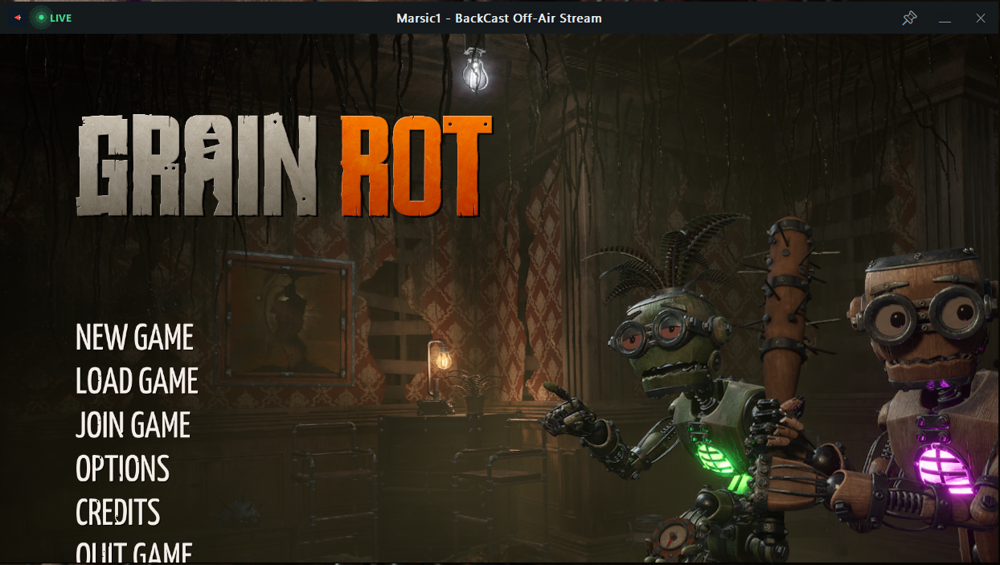

<p align="center">
  
</p>

# BackCast

> **The opposite of broadcast — your OBS scene with friends on Discord, without going live.**

One OBS window. **~1 frame of latency. Video + your voice, together.**



## The problem it solves

You're playing a co-op game with randoms — **R.E.P.O., Lethal Company, Content Warning** — and your friends want to watch. You share your screen on Discord and mute your mic (you don't want the lobby hearing your private conversation). Now your friends can *see* the game… but they can't *hear you*. The moment you mute, you go silent for everyone watching.

**BackCast fixes that.** The BackCast window carries OBS's **full master mix** — game audio *and* your microphone (captured in your OBS scene) — embedded in the stream. Your friends hear you speak **in real time** while your actual Discord mic stays muted, so you can chat naturally with the people watching while the lobby hears nothing. Because the latency is a single frame, conversation just works.

The tagline says it: **BackCast Off-Air Stream** — you're streaming, but you never went live.

## How it works

BackCast is an OBS plugin (with an optional companion app). It opens a window inside OBS that renders the **program output** through the exact same code path OBS's own projector uses — no encoder, no network hop, no media pipeline — so the picture is a frame behind your scene at most. It taps OBS's **master audio mix** and plays it through its own audio stream inside the OBS process, so a single Discord window-share picks up **both video and sound** (Discord captures everything the OBS process plays).

- Video: `obs_render_main_texture` on an `obs_display` — projector-grade, ~1 frame
- Audio: master mix (`audio_output_connect`, mix 0) → in-process WASAPI stream
- Audio goes to an **unused output device** (auto-picked: TV/HDMI/dummy outputs) so you don't hear everything twice
- **When the window is closed, the plugin uses zero resources** — no threads, no windows, no audio stream, no GPU surface (measured, not just claimed)

## Install

### A. The BackCast app (recommended)

Download `BackCast.exe` from the releases — one file, no installer.

1. Run it: the wizard finds your OBS (standard or portable) and installs the plugin (downloaded from GitHub, always the latest version).
2. In OBS: press the **BackCast** button in the menu bar (or bind a hotkey in OBS `Settings → Hotkeys`).
3. In Discord: share the **BackCast** window with **sound on**.

The app also offers a one-click **VB-Cable installer** for machines without a spare audio output, a settings window (audio device, window title, repair/uninstall), and it checks for plugin updates on launch — your audio and title settings survive every update.

### B. Direct plugin install (plugin managers / manual)

Grab `backcast-plugin-windows-x64.zip` from the releases (the name is version-less, so `releases/latest/download/backcast-plugin-windows-x64.zip` is a permanent URL):

- **Plugin managers (StreamUP etc.)**: standard plugin layout — point the manager at it.
- **Standard OBS, manual**: extract, copy the `backcast-projector` folder into `C:\ProgramData\obs-studio\plugins\` (no admin needed).
- **Portable OBS, manual**: copy `bin\64bit\backcast-projector.dll` → `<OBS root>\obs-plugins\64bit\` and `data\locale\en-US.ini` → `<OBS root>\data\obs-plugins\backcast-projector\locale\`.

Everything is configurable from the window's right-click menu — no app required.

## Using it

- **Open/close**: the **BackCast** button in OBS's menu bar, the hotkeys, or the window's ✕. Closed = free.
- **Share**: in Discord, pick the window titled `<your name> - BackCast Off-Air Stream`.
- **Header**: move your mouse to the top edge of the window — a dark header slides in with the status pill (**LIVE** green / **OFF-AIR** amber, pulsing), the title, always-on-top 📌, minimize, and close. It disappears when you move away, so the Discord share stays clean.
- **Right-click menu**: always on top, rename the window, **audio device** (side submenu, switches live), canvas info.
- The pill shows **LIVE** when a Discord sound share has attached to the window (or OBS is streaming/recording). Note: Windows provides no way to detect when a share *detaches* — the pill resets when the window is reopened after an OBS restart.

**Keep audio monitoring OFF on your OBS sources** — anything OBS plays itself is picked up by the share.

## Features

- ~1-frame program video, master-mix audio, one window share
- Zero resource usage while closed
- Clean share: hover-reveal header, constant branding in the title
- Aspect-locked resizing (no letterbox bars), auto-refit on canvas changes
- Auto-picked spare audio output with manual override
- OBS-native hotkeys, portable + standard OBS support, dark WebStage-style UI throughout

## Build from source

Requirements: .NET 8 SDK, CMake ≥ 3.28, Visual Studio 2022/2026 (C++ workload), Windows 10/11 x64.

```bash
# 1. build the OBS plugin (first configure downloads prebuilt libobs via buildspec)
cd plugin
cmake --preset windows-x64
cmake --build --preset windows-x64 --config Release

# 2. publish the app (the plugin is NOT embedded — the app downloads the
#    latest release zip from GitHub at install time)
cd ../src/Backcast
dotnet publish -c Release -r win-x64 --self-contained

# 3. package the plugin zip and verify it contains the fresh plugin
cd ../..
powershell -File make-release.ps1
```

## Support the project

If BackCast makes your game nights better, consider buying me a coffee:

[](https://ko-fi.com/marsic1)

## License

GPL-2.0 — the plugin builds on the [obs-plugintemplate](https://github.com/obsproject/obs-plugintemplate) and libobs.
